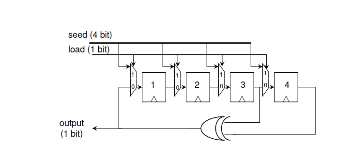
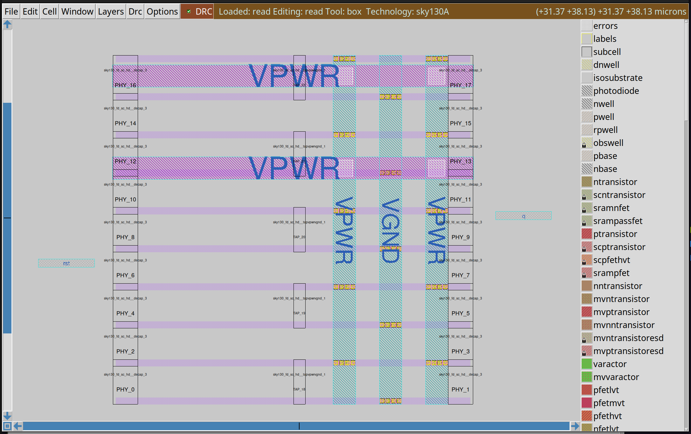
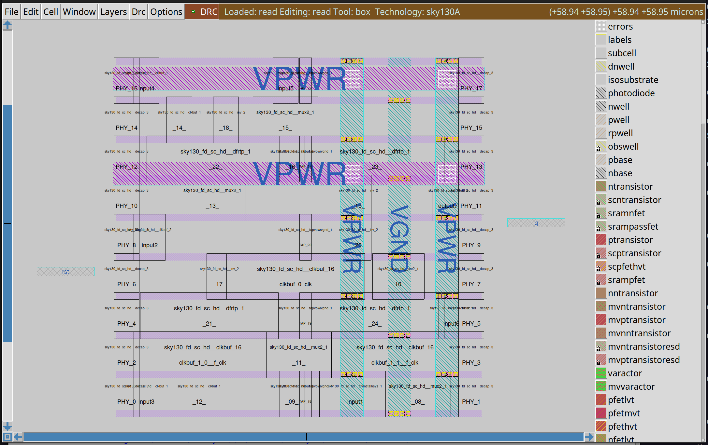
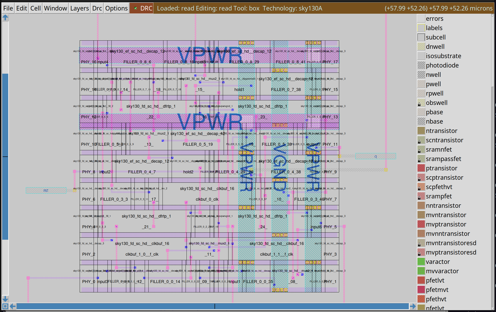

# LFSR - Linear Feedback Shift Register (with OpenLane flow)

## 0. PREPARE PROJECT

run the below commands
```sh
cd ~
mkdir lfsr
cd lfsr
mkdir src lib script sim netlist log
cd src
wget https://raw.githubusercontent.com/truong92cdv/lfsr/refs/heads/main/src/lfsr.v
wget https://raw.githubusercontent.com/truong92cdv/lfsr/refs/heads/main/src/lfsr_tb.v
cd ../lib
wget https://raw.githubusercontent.com/truong92cdv/lfsr/refs/heads/main/lib/primitives.v
wget https://raw.githubusercontent.com/truong92cdv/lfsr/refs/heads/main/lib/sky130_fd_sc_hd__tt_025C_1v80.lib
wget https://raw.githubusercontent.com/truong92cdv/lfsr/refs/heads/main/lib/sky130_fd_sc_hd.v
cd ../script
wget https://raw.githubusercontent.com/truong92cdv/lfsr/refs/heads/main/script/sim.sh
wget https://raw.githubusercontent.com/truong92cdv/lfsr/refs/heads/main/script/synth.sh
wget https://raw.githubusercontent.com/truong92cdv/lfsr/refs/heads/main/script/synth.ys
wget https://raw.githubusercontent.com/truong92cdv/lfsr/refs/heads/main/script/sim_gatelevel.sh
chmod +x *
```

### project hiearchy


## 1. RTL DESIGN

[lfsr.v](./src/lfsr.v)

Verilog code implements a 4-bit Linear Feedback Shift Register (LFSR) to generate a pseudo-random bit sequence. It consists of three modules: mux (2-to-1 multiplexer), flipflop (D-type flip-flop with reset), and lfsr (main module). The LFSR shifts a 4-bit state, with feedback via XOR of bits 2 and 3, and supports seed loading or shifting based on a control signal.



## 2. RTL SIMULATION

### Verilog testbench

[lfsr_tb.v](./src/lfsr_tb.v)

### sim.sh
```sh
#!/bin/bash
exec > ../log/sim.log 2>&1
iverilog ../src/lfsr.v ../src/lfsr_tb.v -o ../sim/lfsr
vvp ../sim/lfsr
gtkwave ../sim/lfsr.vcd
```

### RTL simulation with gtkwave

```sh
./sim.sh
```


## 3. SYNTHESIS

### yosys run script (synth.ys)

```sh
read_liberty -lib ../lib/sky130_fd_sc_hd__tt_025C_1v80.lib
read_verilog ../src/lfsr.v
synth -top lfsr
dfflibmap -liberty ../lib/sky130_fd_sc_hd__tt_025C_1v80.lib
abc -liberty ../lib/sky130_fd_sc_hd__tt_025C_1v80.lib
clean
flatten
write_verilog -noattr ../netlist/lfsr_synth.v
stat
show -format dot -prefix ../netlist/lfsr_synth
```

### run synth.sh
```sh
./synth.sh
```

After runing synthesis, we got netlist file **netlist/lfsr_synth.v**, gate schematic **netlist/lfsr_synth.dot**, and the log file **log/synth.log**
In the log file, we can see

```log
8. Printing statistics.

=== lfsr ===

   Number of wires:                 44
   Number of wire bits:             53
   Number of public wires:          40
   Number of public wire bits:      49
   Number of memories:               0
   Number of memory bits:            0
   Number of processes:              0
   Number of cells:                 13
     sky130_fd_sc_hd__clkinv_1       4
     sky130_fd_sc_hd__dfrtp_1        4
     sky130_fd_sc_hd__mux2_1         4
     sky130_fd_sc_hd__xor2_1         1
```

The netlist includes 13 cells: 4 **D_ff**, 4 gates **mux**, 1 gate **xor**, 4 gates **inverter**. We need **inverter** to invert the **rst** signal, because the standard cell **sky130_fd_sc_hd__dfrtp_1** is a neg-edge D-ff while we need a pos-edge D-ff.


## 4. GATE LEVEL SIMULATION

While performing GLS we use skywater 130 nm technology library files to import the cells from the library. Using those cells we then generate the netlist which would be a new .v file generated by write_verilog command. With this file and the testbench we generated for the RTL simulation we would again get a new waveform for this GLS netlist. This waveform should match with our initial waveform, infact waveforms if every stages of the flow should match the initial design waveform.

Go to the script directory, we will run the **sim_gatelevel.sh**:

```sh
#!/bin/bash
exec > ../log/sim_gatelevel.log 2>&1
iverilog ../lib/primitives.v ../lib/sky130_fd_sc_hd.v ../netlist/lfsr_synth.v ../src/lfsr_tb.v -o ../sim/lfsr_gatelevel
vvp ../sim/lfsr_gatelevel
gtkwave ../sim/lfsr.vcd
```

Run GSL sim, you should got the Gtk waveform that match the previous one:

```sh
./sim_gatelevel.sh
```
## 5. OPENLANE FLOW

### OpenLane

OpenLane is an automated RTL to GDSII flow based on several components including OpenROAD, Yosys, Magic, Netgen, CVC, SPEF-Extractor, CU-GR, Klayout and a number of custom scripts for design exploration and optimization. The flow performs full ASIC implementation steps from RTL all the way down to GDSII.

### init design

Go to OpenLane directory in your system.

```sh
cd OpenLane
make mount
./flow.tcl -design lfsr -init_design_config -add_to_designs
cp /home/drx/Desktop/chip_design/Lab/lfsr/src/lfsr.v designs/lfsr/src/lfsr.v
```

OpenLane would create the automatic **config.json** as below:


Then run the Openlane flow:

```sh
./flow.tcl -design lfsr
```


Opps! Your first run will not success. You will got some WARNINGs and ERRORs

```sh
[STEP 3]
[INFO]: Running Initial Floorplanning (log: designs/lfsr/runs/RUN_2025.08.13_16.28.31/logs/floorplan/3-initial_fp.log)...
[WARNING]: Current core area is too small for the power grid settings chosen. The power grid will be scaled down.

...

[STEP 6]
[INFO]: Generating PDN (log: designs/lfsr/runs/RUN_2025.08.13_16.28.31/logs/floorplan/6-pdn.log)...
[ERROR]: during executing openroad script /openlane/scripts/openroad/pdn.tcl
[ERROR]: Log: designs/lfsr/runs/RUN_2025.08.13_16.28.31/logs/floorplan/6-pdn.log
[ERROR]: Last 10 lines:
Using 1e+03 for resistance...
Using 1e-09 for time...
Using 1e+00 for voltage...
Using 1e-03 for current...
Using 1e-09 for power...
Using 1e-06 for distance...
Reading design constraints file at '/openlane/designs/lfsr/runs/RUN_2025.08.13_16.28.31/tmp/floorplan/3-initial_fp.sdc'…
[ERROR PDN-0175] Pitch 4.9450 is too small for, must be atleast 6.6000
Error: pdn_cfg.tcl, 92 PDN-0175
child process exited abnormally

[ERROR]: Creating issue reproducible...

...

[ERROR]: Flow failed.
[INFO]: The failure may have been because of the following warnings:
[WARNING]: Current core area is too small for the power grid settings chosen. The power grid will be scaled down.

```

### FIX BUGS

Pay attention to this ERROR
```sh
[ERROR PDN-0175] Pitch 4.9450 is too small for, must be atleast 6.6000
```

It says that the Pitch (the distance between Power grids) is too small, so it could cause the electrical problem. You should add some line in the **config.json** file to set **FP_PDN_VPITCH** and **FP_PDN_HPITCH**.

And this WARNING
```sh
[WARNING]: Current core area is too small for the power grid settings chosen. The power grid will be scaled down.
```

To fix this, you must set **"FP_CORE_UTIL"** to another value (default is 0.5).
Here is how I adjust **config.json** file:

```json
{
    "DESIGN_NAME": "lfsr",
    "VERILOG_FILES": "dir::src/*.v",
    "CLOCK_PORT": "clk",
    "CLOCK_PERIOD": 10.0,
    "DESIGN_IS_CORE": true,
    "FP_PDN_VPITCH": 6.6,
    "FP_PDN_HPITCH": 6.6,
    "FP_CORE_UTIL": 0.4
}
```

After fixing, run Openlane flow again:
```sh
./flow.tcl -design lfsr
```


Boom! **Flow completed!**

# 6. LAYOUT VIEW

You can view the physical layout after every step to see how the things go.
First, go to the **result** dir in your final RUN* directory


## 1. Floorplan

```sh
magic -T /home/drx/Desktop/chip_design/open_pdks/sky130/sky130A/libs.tech/magic/sky130A.tech lef read ../tmp/merged.nom.lef def read ./floorplan/lfsr.def &
```


## 2. Placement

```sh
magic -T /home/drx/Desktop/chip_design/open_pdks/sky130/sky130A/libs.tech/magic/sky130A.tech lef read ../tmp/merged.nom.lef def read ./placement/lfsr.def &
```


## 3. Clock Tree Synthesis

```sh
magic -T /home/drx/Desktop/chip_design/open_pdks/sky130/sky130A/libs.tech/magic/sky130A.tech lef read ../tmp/merged.nom.lef def read ./cts/lfsr.def &
```



## 4. Routing

```sh
magic -T /home/drx/Desktop/chip_design/open_pdks/sky130/sky130A/libs.tech/magic/sky130A.tech lef read ../tmp/merged.nom.lef def read ./routing/lfsr.def &
```



## 5. Final

```sh
magic -T /home/drx/Desktop/chip_design/open_pdks/sky130/sky130A/libs.tech/magic/sky130A.tech read ./final/mag/lfsr.mag &
```


# 7. POWER, PERFORMANCE, AREA (PPA) ANALYSIS

## POWER REPORT


**Total power** is **90.2 µW**. In that, the **Internal power** accounts for 80%, the **Switching power** accounts for 20%.

## PERFORMANCE REPORT


- tns = 0 (total negative slack)
- wns = 0 (worst negative slack)
- worst slack (setup) = 6.37 > 0

That means there is no timing violation in our design.
We could calculate the maximum Freq as below

```
f(max) = 1 / (min clk period) = 1 / (clk period - worst slack)
f(max) = 1 / (10 - 6.37) = 275 MHz
```

In theory, you can push clk frequency to 275 MHz without affecting the design

## AREA REPORT


Area = 56,617.648 µm2

